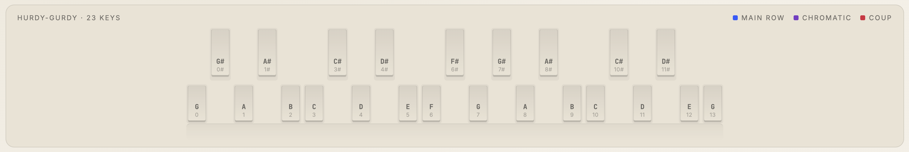

# Learny Gurdy

A web app that turns MIDI files into hurdy-gurdy practice material: tabs, a scrolling staff, an animated keybox, and a synth that plays along while you learn.

Drop in one of the included songs or upload your own `.mid` file and get a playable, visual practice page.

## What it does

- **Tab lane** — a scrolling, guitar-style readout of the keys to press, written either as note names or as tab numbers.
- **Staff view** — a moving classical staff for the same passage, in case you prefer reading notes.
- **Keybox** — a diagram of the hurdy-gurdy keyboard that lights up the keys you should be pressing right now.
- **Crank display** — a visual cue for cranking speed and the *coup* (auto-detected on the downbeat of each bar).
- **Synth playback** — hear the melody at full speed or slowed down, to check you're on the right notes.
- **Metronome** with a stronger click on the downbeat.
- **Transpose** in semitones, **tempo** as a percentage, and an A/B **loop** for drilling tricky passages.
- **Tonic selector** so the tabs match how your melody strings are tuned (default `G`).
- **Adjustable key count** (7–36) so the keybox matches your instrument.
- **Several color palettes**, including paper-and-ink and high-contrast.
- **Local library** — uploaded songs are saved in your browser; built-in songs are bundled with the app.

## Run it locally

```bash
npm install
npm run dev
```

Then open the URL Vite prints in the terminal. To build a static version:

```bash
npm run build
npm run preview
```

The app is plain Vue 3 + Vite, with [`@tonejs/midi`](https://github.com/Tonejs/Midi) for MIDI parsing. No backend.

## Tabs notation

Each key on the hurdy-gurdy gets a number, counting up from the lowest. `0` means no key pressed (the open string / drone). Chromatic keys are written as the previous diatonic key plus `#` — so `3#` is the chromatic key sitting between keys `3` and `4`.



If your melody string is tuned to `G`, then key `3` plays a `C`, and `3#` plays a `C♯`. Set the tonic in the top bar and the tabs adjust automatically.

## Supported files

- **MIDI** (`.mid`, `.midi`) — fully supported. The track with the most notes is treated as the melody.

## Motivation

I'm learning to play the hurdy-gurdy and struggle to find practice material with notes I can actually follow along with. I'm also not great at reading sheet music — coming from guitar, tab notation has always clicked for me much faster than a staff. So I built the readout I wished existed: something that takes a MIDI file and gives me back keys to press, in the right order, at a tempo I can keep up with.

It's far from perfect, but it has helped me learn songs much faster than I otherwise would.

## Disclaimer

I'm not a hurdy-gurdy expert and not a music theory expert either. Some terminology may be off, and a few assumptions baked into the app may be wrong for instruments tuned differently from mine. Pull requests and corrections are welcome.
